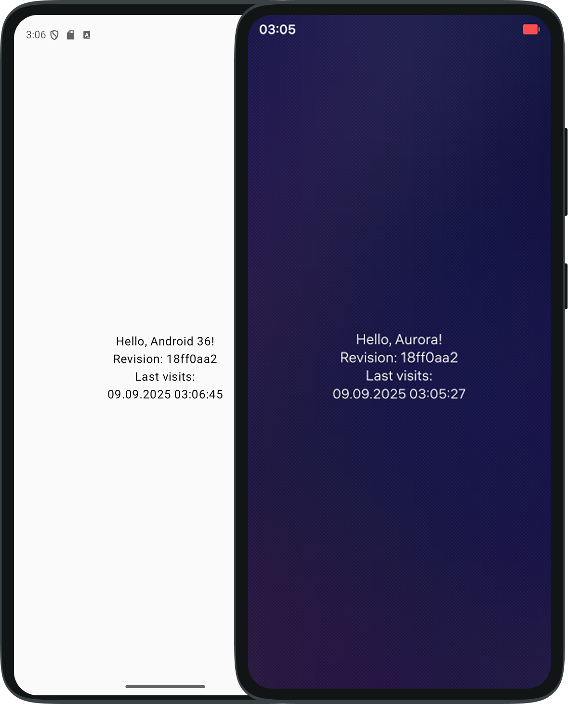

# aurora-kmp-example

A simple example of using KMP on the Aurora OS.

> [!WARNING]  
> Currently, the project uses unpublished libraries for Aurora OS from a local Maven repository. However, since the project comes with pre-built artifacts, it can be compiled in Aurora IDE under Aurora OS.

> [!NOTE]
> Currently, building projects in Aurora IDE is only available on the Linux platform.
> Building on macOS with arm64 chips will be supported when Aurora IDE for version 5.2 is released to the public.

## Preview



## Libraries

- Ktor
- SQLDelight
- Serialization
- Coroutines

## Supported platforms

- Android (KMP + Compose)
- Aurora x64 (KMP + QML)

## Build project for Android

```shell
$ ./gradlew :shared:generateCommonMainVisitDatabaseInterface
$ ./gradlew :androidApp:assembleDebug
```

## Build project for Aurora

```shell
$ ./gradlew :shared:generateCommonMainVisitDatabaseInterface
$ ./gradlew :shared:compileArtifactsAurora
```

1. Open [./auroraApp/com.example.aurorakmp.pro](./auroraApp/com.example.aurorakmp.pro) in [Aurora IDE](https://developer.auroraos.ru/downloads/sdk_mb2/5.1.5.105/linux)
2. Select `Build & Run` configuration for `x86_64` target
3. Press `Run` button to run project on emulator
